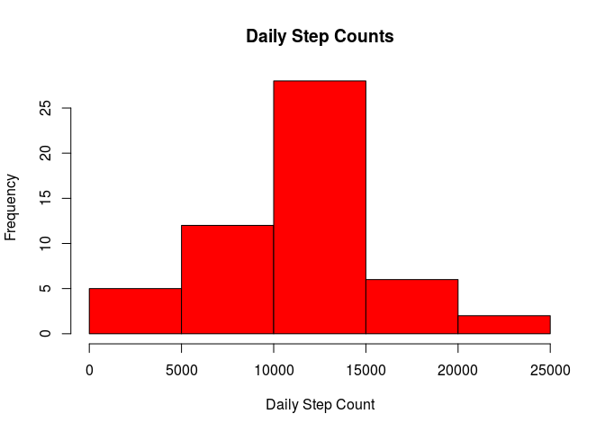
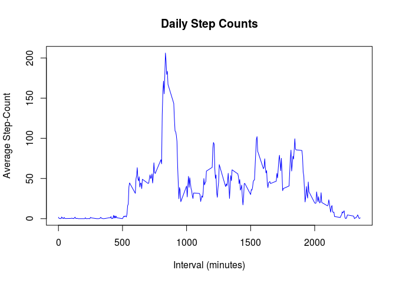
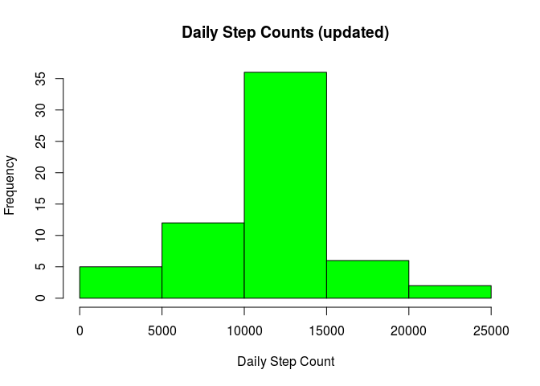
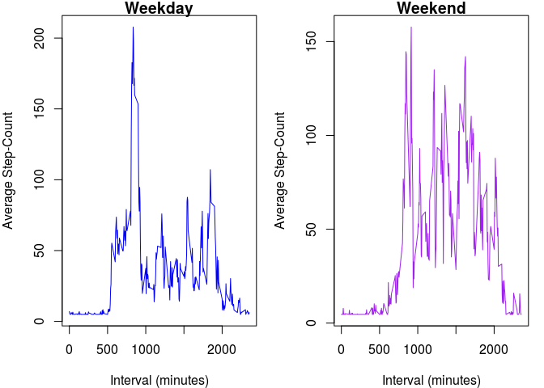

# Reproducible Research: Peer Assessment 1


```r
require(data.table)
```

```
## Loading required package: data.table
```

## Loading and preprocessing the data


```r
data.raw <- fread(unzip("activity.zip",files="activity.csv"))
head(data.raw)
```

```
##    steps       date interval
## 1:    NA 2012-10-01        0
## 2:    NA 2012-10-01        5
## 3:    NA 2012-10-01       10
## 4:    NA 2012-10-01       15
## 5:    NA 2012-10-01       20
## 6:    NA 2012-10-01       25
```

Next, incomplete cases are removed.  
This is accomplished by adding a logical column that's true for complete cases


```r
data.raw[,comp_case:= complete.cases(steps,date,interval)]
data <- copy( data.raw[comp_case==TRUE] )
head(data)
```

```
##    steps       date interval comp_case
## 1:     0 2012-10-02        0      TRUE
## 2:     0 2012-10-02        5      TRUE
## 3:     0 2012-10-02       10      TRUE
## 4:     0 2012-10-02       15      TRUE
## 5:     0 2012-10-02       20      TRUE
## 6:     0 2012-10-02       25      TRUE
```

## What is mean total number of steps taken per day?


```r
data.ts <- data[,sum(steps),by=date]
names(data.ts) <- c("date","total_steps")
```

Plotting a histogram of the steps


```r
hist(data.ts$total_steps,main="Daily Step Counts",xlab="Daily Step Count",ylab="Frequency",col="red")
```



Calculating mean


```r
ts.mean <- mean(data.ts$total_steps)
ts.mean
```

```
## [1] 10766.19
```

Returning median


```r
ts.median <- median(data.ts$total_steps)
ts.median
```

```
## [1] 10765
```

## What is the average daily activity pattern?


```r
data.asbi <- data[,mean(steps),by=interval]
names(data.asbi) <- c("interval","mean_steps")
```

So with step count is averaged for each 5-minute interval, 
plotted to show average levels of activity through the day


```r
plot(data.asbi$interval,data.asbi$mean_steps,type="l",main="Daily Step Counts",xlab="Interval (minutes)",ylab="Average Step-Count",col="blue")
```



The 5-minute interval with the largest average step count


```r
maxInterval <- max(data.asbi$mean_steps)
data.asbi[mean_steps==maxInterval]
```

```
##    interval mean_steps
## 1:      835   206.1698
```

## Inputing missing values

The total missing value can be expressed as the sum of logical columns from the original data table


```r
with( data.raw, sum(is.na(date))+sum(is.na(interval)) )
```

```
## [1] 0
```

```r
with( data.raw, sum(is.na(steps)) )
```

```
## [1] 2304
```

Noting that only steps are missing means all instances of incomplete cases are taged by the 'comp_case' column.  
Missing values are substituted with the average of their date


```r
averageSteps <- as.integer(mean(data$steps))
data.raw[comp_case==FALSE,steps:= averageSteps]
```

Re-plotting the histogram with updated missing values


```r
data.ts <- data.raw[,sum(steps),by=date]
names(data.ts) <- c("date","total_steps")
hist(data.ts$total_steps,main="Daily Step Counts (updated)",xlab="Daily Step Count",ylab="Frequency",col="green")
```



## Are there differences in activity patterns between weekdays and weekends?

Adding a factor column to indicate if an entry is for a weekday


```r
data.raw[,day:= weekdays( as.Date(date, format="%Y-%m-%d") )]
data.raw[,dayType:= ifelse( day=="Sunday" | day=="Saturday", "weekend", "weekday" ) ]
head(data.raw)
```

```
##    steps       date interval comp_case    day dayType
## 1:    37 2012-10-01        0     FALSE Monday weekday
## 2:    37 2012-10-01        5     FALSE Monday weekday
## 3:    37 2012-10-01       10     FALSE Monday weekday
## 4:    37 2012-10-01       15     FALSE Monday weekday
## 5:    37 2012-10-01       20     FALSE Monday weekday
## 6:    37 2012-10-01       25     FALSE Monday weekday
```

Making a data set for weekend and weekday data


```r
# Weekday average steps by interval
data.wkd <- data.raw[dayType=='weekday'][,mean(steps),by=interval]
names(data.wkd) <- c("interval","mean_steps")
# Weekend average steps by interval
data.wke <- data.raw[dayType=='weekend'][,mean(steps),by=interval]
names(data.wke) <- c("interval","mean_steps")
```

Plotting based on average intervals, grouped by dayType


```r
par(mfrow=c(1, 2), mar=c(4, 4, 1, 1))
# Weekday plot (left)
with(data.wkd, plot( interval, mean_steps, type="l",main="Weekday",xlab="Interval (minutes)",ylab="Average Step-Count",col="blue")  )
# Weekend plot (right)
with(data.wke, plot( interval, mean_steps, type="l",main="Weekend",xlab="Interval (minutes)",ylab="Average Step-Count",col="purple")  )
```




